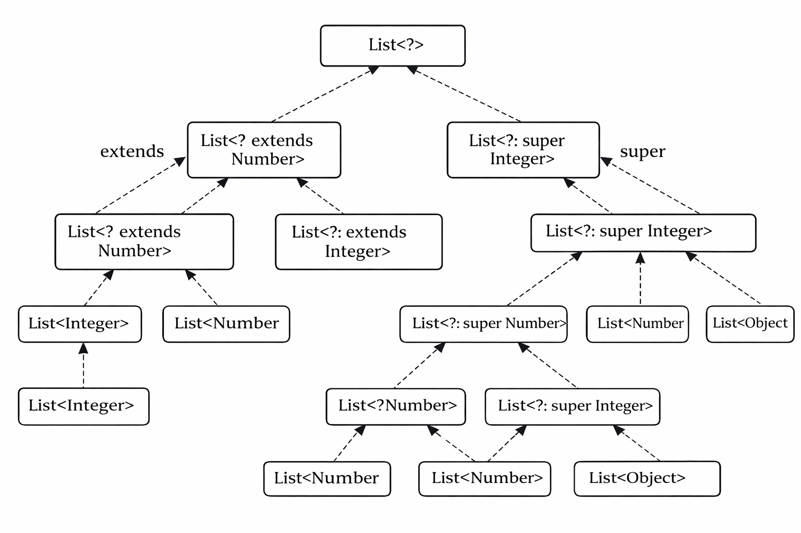

```
List<?>
├── List<? extends Number>
│   ├── List<? extends Integer>
│   │   └── List<Integer>
│   └── List<Number>
│
└── List<? super Integer>
    ├── List<Integer>
    ├── List<Number>
    │   └── List<? super Number>
    └── List<Object>
```


 