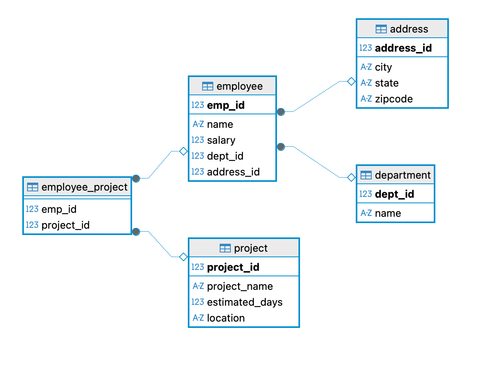

# Lab7 #

### ERD Diagram

~~~~sql
CREATE TABLE Address (
 address_id INT PRIMARY KEY,
 city VARCHAR(50) NOT NULL,
 state CHAR(2) NOT NULL,
 zipcode VARCHAR(10)
);

CREATE TABLE Department (
    dept_id int PRIMARY KEY,
    name VARCHAR(100)
);

CREATE TABLE Project (
    project_id int PRIMARY KEY,
    project_name VARCHAR(100),
    estimated_days int,
    location VARCHAR(100)
);

CREATE TABLE Employee (
    emp_id int PRIMARY KEY,
    name VARCHAR(100),
    salary int,
    dept_id int,
    address_id int,
    CONSTRAINT fk_address
    FOREIGN KEY (address_id)
    REFERENCES address(address_id),
    CONSTRAINT fk_department
    FOREIGN KEY (dept_id)
    REFERENCES department(dept_id)
);

CREATE TABLE Employee_Project (
    emp_id int,
    project_id int,
    CONSTRAINT fk_employee
    FOREIGN KEY (emp_id)
    REFERENCES employee (emp_id),
    CONSTRAINT fk_project
    FOREIGN KEY (project_id)
    REFERENCES project(project_id)
);

-- *** 1. Insert Data into Address Table ***
INSERT INTO Address (address_id, city, state, zipcode) VALUES
(1, 'Fairfield', 'IA', '52556'),
(2, 'Iowa City', 'IA', '52440'),
(3, 'Morrison', 'IL', '61270'),
(4, 'Orlando', 'FL', '34565'),
(5, 'Tampa', 'FL', '31765');

-- *** 2. Insert Data into Department Table ***
INSERT INTO Department (dept_id, name) VALUES
(1, 'Tech'),
(2, 'HR'),
(3, 'Finance'),
(4, 'Marketing');

-- *** 3. Insert Data into Project Table ***
INSERT INTO Project (project_id, project_name, estimated_days, location)
VALUES
(1, 'X', 180, 'FL'),
(2, 'Y', 60, 'FL'),
(3, 'Z', 80, 'IA');

-- *** 4. Insert Data into Employee Table ***
-- NOTE: This depends on Address (address_id) and Department (dept_id) being populated first.
INSERT INTO Employee (emp_id, name, salary, address_id, dept_id) VALUES
(111, 'Zaineh', 100000, 1, 1),
(112, 'Yasmeen', 160000, 2, 4),
(113, 'Mira', 140000, 3, 3),
(114, 'Shimaa', 200000, 4, 2),
(115, 'Dean', 150000, 5, 1);

-- *** 5. Insert Data into Employee_Project Table ***
-- NOTE: This depends on Employee (emp_id) and Project (project_id) being populated first.
INSERT INTO Employee_Project (emp_id, project_id) VALUES
(115, 1),
(115, 2),
(115, 3),
(114, 1),
(114, 3),
(111, 1),
(111, 2);

-- 3. A
select name, salary from employee;
select project_name from project where location = 'FL';

select ep.emp_id, ep.project_id from project p 
	left join employee_project ep on p.project_id = ep.project_id 
	where p.project_name = 'X';

select distinct(a.state) from employee e
	left join address a on e.address_id = a.address_id;

select name, e.salary from employee e where e.salary < 150000;

select project_name from project order by estimated_days desc;

select distinct(emp_id) from employee_project ep;

-- 3. B

select AVG(salary) from employee e;
select max(p.estimated_days) from project p;

select d.dept_id, sum(e.salary) as total_salary from department d
	left join employee e on d.dept_id = e.dept_id
	group by d.dept_id
	order by total_salary desc;

select d.dept_id, AVG(e.salary) as avg_salary from department d
	left join employee e on d.dept_id = e.dept_id
	group by d.dept_id
	having  AVG(e.salary) > 150000
	order by avg_salary desc;

-- 3. C

select e."name", a.city from employee e 
	left join address a on e.address_id = a.address_id;

select d."name", e."name" from department d 
	left join employee e on d.dept_id = e.dept_id;

select e."name", p.project_name from employee_project ep
	left join employee e on e.emp_id = ep.emp_id
	left join project p on p.project_id = ep.project_id;

-- 3. D

select name from employee e
	where salary = (SELECT MAX(salary) FROM Employee);

select e."name" from employee e 
	where e.emp_id in (select emp_id from employee_project ep where project_id in (select project_id from project p where estimated_days = 180))
	
select project_id from project p where p.estimated_days > (select AVG(estimated_days) from project);
~~~~