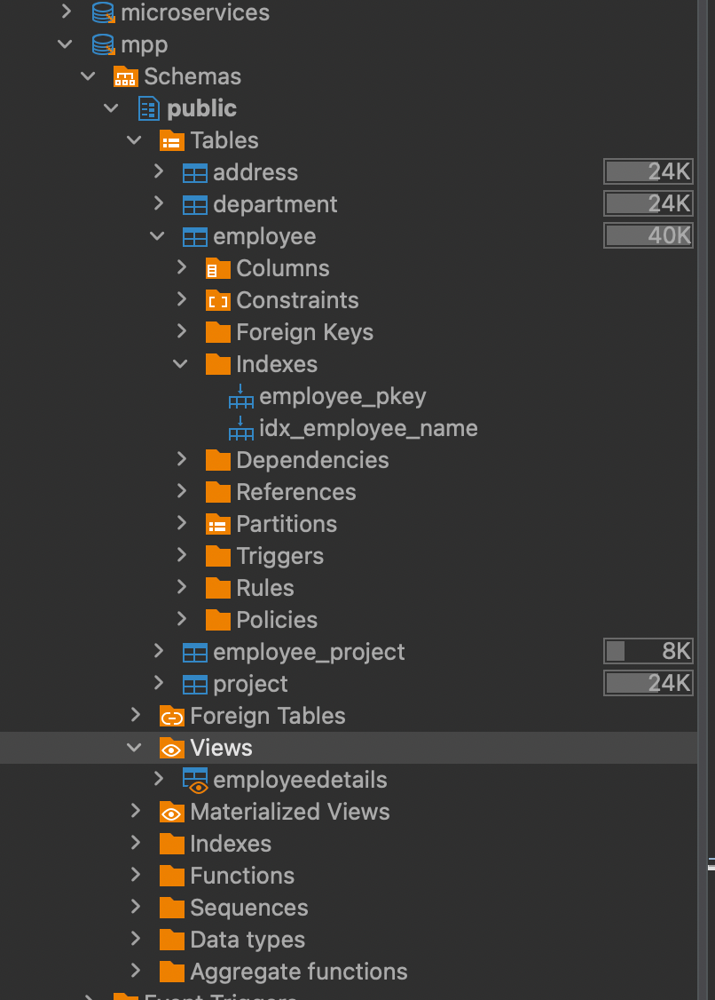

# Lab8 #

### A. Creating a Database View
~~~~sql
CREATE VIEW EmployeeDetails as
SELECT e.emp_id, e."name" employee_name, e.salary, d."name", p.project_name  FROM employee e
	left join department d on e.dept_id = d.dept_id 
	left join employee_project ep on e.emp_id = ep.emp_id 
	left join project p on p.project_id  = ep.project_id;
~~~~

### B. Adding an Index
~~~~sql
CREATE INDEX idx_employee_name ON employee (name);
~~~~

