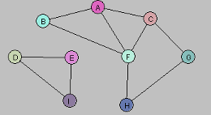

## 1.	What is the adjacency matrix of the graph G = (V,E) displayed below 



|   | A | B | C | D | E | F | G | H | I |
|---|---|---|---|---|---|---|---|---|---|
| **A** | 0 | 1 | 1 | 0 | 0 | 1 | 0 | 0 | 0 |
| **B** | 1 | 0 | 0 | 0 | 0 | 1 | 0 | 0 | 0 |
| **C** | 1 | 0 | 0 | 0 | 0 | 1 | 1 | 0 | 0 |
| **D** | 0 | 0 | 0 | 0 | 1 | 0 | 0 | 0 | 1 |
| **E** | 0 | 0 | 0 | 1 | 0 | 0 | 0 | 0 | 1 |
| **F** | 1 | 1 | 1 | 0 | 0 | 0 | 0 | 1 | 0 |
| **G** | 0 | 0 | 1 | 0 | 0 | 0 | 0 | 1 | 0 |
| **H** | 0 | 0 | 0 | 0 | 0 | 1 | 1 | 0 | 0 |
| **I** | 0 | 0 | 0 | 1 | 1 | 0 | 0 | 0 | 0 |

## 2.	Create a Java program to find all components of a graph given the adjacency matrix through DFS. Test your program on the above graph.

```java

static int DFSCheckAdjacent(int[][] arr, boolean[] visited, int v) {
        for (int k = 0; k < arr[v].length; k++) {
            if (arr[v][k] == 1 && !visited[k]) {
                return k;
            }
        }
        return -1;
    }

    static int DFS(int[][] arr) {
        int components = 0;
        boolean[] visited = new boolean[arr.length];
        for (int i = 0; i < arr.length; i++) {
            if (visited[i]) {
                continue;
            }

            components++;

            visited[i] = true;
            Stack<Integer> stack = new Stack<>();
            stack.push(i);

            while (!stack.isEmpty()) {
                int v = stack.peek();
                int adjacent = DFSCheckAdjacent(arr, visited, v);
                if (adjacent != -1) {
                    visited[adjacent] = true;
                    stack.push(adjacent);
                } else {
                    stack.pop();
                }
            }

        }
        return components;
    }
```


## 3.	Create a Java program to find all components of a graph given the adjacency matrix through BFS. Test your program on the above graph.

```java
static int BFS(int[][] arr) {
        int components = 0;
        boolean[] visited = new boolean[arr.length];
        for (int i = 0; i < arr.length; i++) {
            if (visited[i]) {
                continue;
            }
            components++;
            visited[i] = true;
            Queue<Integer> queue = new ArrayDeque<>();
            queue.add(i);
            while (!queue.isEmpty()) {
                int v = queue.poll();
                for (int k = 0; k < arr[v].length; k++) {
                    if (arr[v][k] == 1 && !visited[k]) {
                        visited[k] = true;
                        queue.add(k);
                    }
                }
            }
        }
        return components;
    }
```