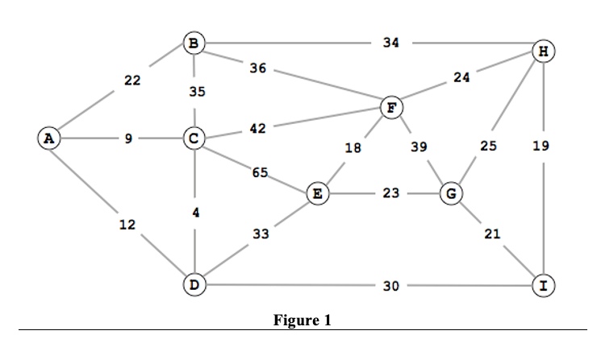
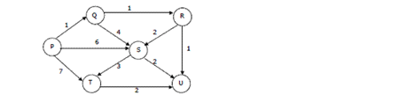

## 1.	What is the adjacency matrix of the weighted graph G = (V,E) shown in Figure 1.


|   | A | B | C | D | E | F | G | H | I |
|---|---:|---:|---:|---:|---:|---:|---:|---:|---:|
| **A** | 0 | 1 | 1 | 1 | 0 | 0 | 0 | 0 | 0 |
| **B** | 1 | 0 | 1 | 0 | 0 | 1 | 0 | 1 | 0 |
| **C** | 1 | 1 | 0 | 1 | 1 | 1 | 0 | 0 | 0 |
| **D** | 1 | 0 | 1 | 0 | 1 | 0 | 0 | 0 | 1 |
| **E** | 0 | 0 | 1 | 1 | 0 | 1 | 1 | 0 | 0 |
| **F** | 0 | 1 | 1 | 0 | 1 | 0 | 1 | 1 | 0 |
| **G** | 0 | 0 | 0 | 0 | 1 | 1 | 0 | 1 | 1 |
| **H** | 0 | 1 | 0 | 0 | 0 | 1 | 1 | 0 | 1 |
| **I** | 0 | 0 | 0 | 1 | 0 | 0 | 1 | 1 | 0 |


## 2. Shortest Path from A Using Dijkstra’s Algorithm

| Vertex | dis | Path |
|---|---:|---|
| A | 0 | A |
| B | 22 | AB |
| C | 9 | AC |
| D | 12 | AD |
| E | 45 | ADE |
| F | 51 | ACF |
| G | 63 | ADIG |
| H | 56 | ABH |
| I | 42 | ADI |

## 3. What is the time complexity?
```
Time complexity -> O(mlogn)
m -> edge -> 18
n -> vertex -> 9

O(18log9) -> O(17.17)
```

## 4.	Find a minimum spanning tree using Kruskal’s Algorithm 

| Edge | Weight |
|---|---:|
| C-D | 4 |
| A-C | 9 |
| A-D | 12 |
| E-F | 18 |
| H-I | 19 |
| G-I | 21 |
| A-B | 22 |
| E-G | 23 |
| F-H | 24 |
| G-H | 25 |
| D-I | 30 |
| D-E | 33 |
| B-H | 34 |
| B-C | 35 |
| B-F | 36 |
| F-G | 39 |
| C-F | 42 |
| C-E | 65 |

Kruskal chooses the smallest edges without creating a cycle.

Selected MST edges:

| Step | Edge | Weight |
|---:|---|---:|
| 1 | C-D | 4 |
| 2 | A-C | 9 |
| 3 | E-F | 18 |
| 4 | H-I | 19 |
| 5 | G-I | 21 |
| 6 | A-B | 22 |
| 7 | E-G | 23 |
| 8 | D-I | 30 |

Total MST weight:

```text
4 + 9 + 18 + 19 + 21 + 22 + 23 + 30 = 146
```


## 5.	What is the time complexity?
```
Time complexity -> O(mlogn)
m -> edge -> 18
n -> vertex -> 9

O(18log9) -> O(17.17)
```


## 6. What is the adjacency matrix of the weighted directed Acyclic graph G = (V,E) shown in Figure 2.



|   | P | Q | R | S | T | U |
|---|---:|---:|---:|---:|---:|---:|
| **P** | 0 | 1 | 0 | 6 | 7 | 0 |
| **Q** | 0 | 0 | 1 | 4 | 0 | 0 |
| **R** | 0 | 0 | 0 | 2 | 0 | 1 |
| **S** | 0 | 0 | 0 | 0 | 3 | 2 |
| **T** | 0 | 0 | 0 | 0 | 0 | 2 |
| **U** | 0 | 0 | 0 | 0 | 0 | 0 |

Directed edges:

| Edge | Weight |
|---|---:|
| PQ | 1 |
| PS | 6 |
| PT | 7 |
| QR | 1 |
| QS | 4 |
| RS | 2 |
| RU | 1 |
| ST | 3 |
| SU | 2 |
| TU | 2 |

## 7.	Find the shortest path from P to U. (Figure 2). (Use the algorithm starting at slide 33).

Topological Ordering: `PQRSTU`

| Vertex | Dic | Path |
|---:|---|---:|
| P | 0 | - |
| Q | 1 | PQ |
| R | 2 | PQR |
| S | 4 | PQRS |
| T | 5 | PQRUT |
| U | 3 | PQRU |

## 8.	What is the time complexity
```
O (n+m)
O (6 + 10)
```

## 9.	Can you use Dijkstra’s algorithm (Slide 12) to find the shortest path from P to U? (Figure 2). 

No. Beacause this graph is direct graph